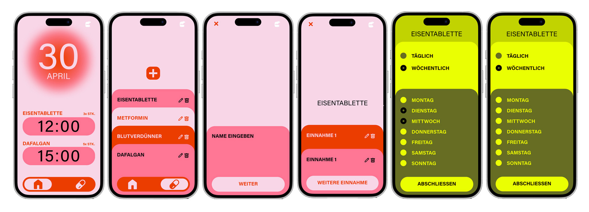
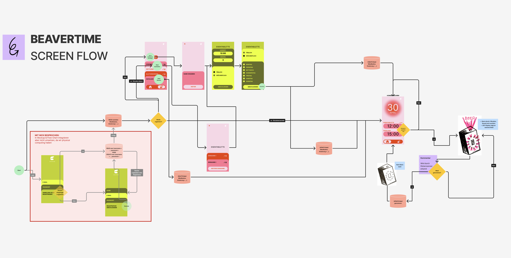
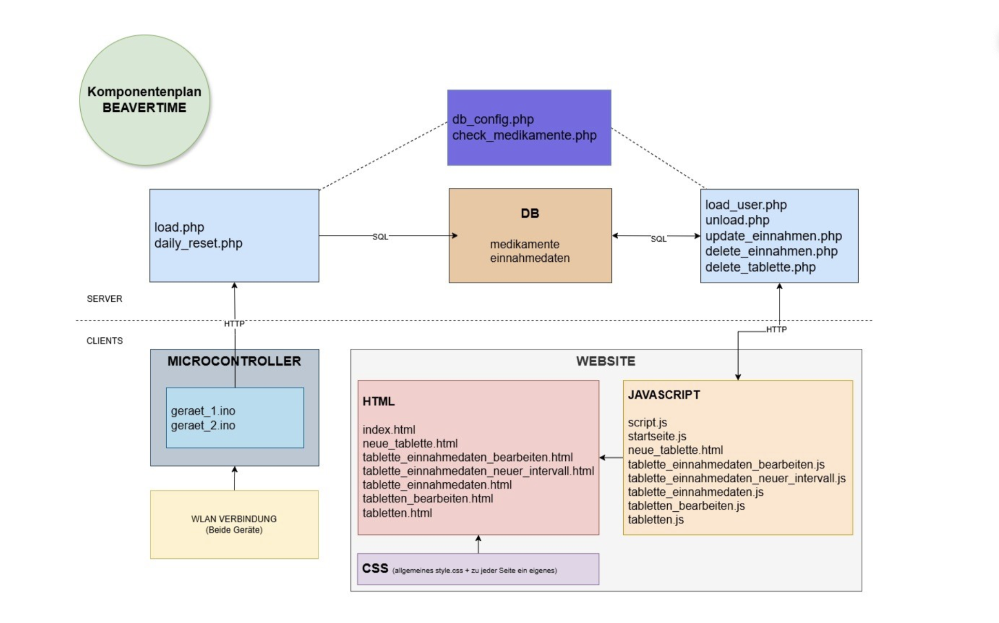
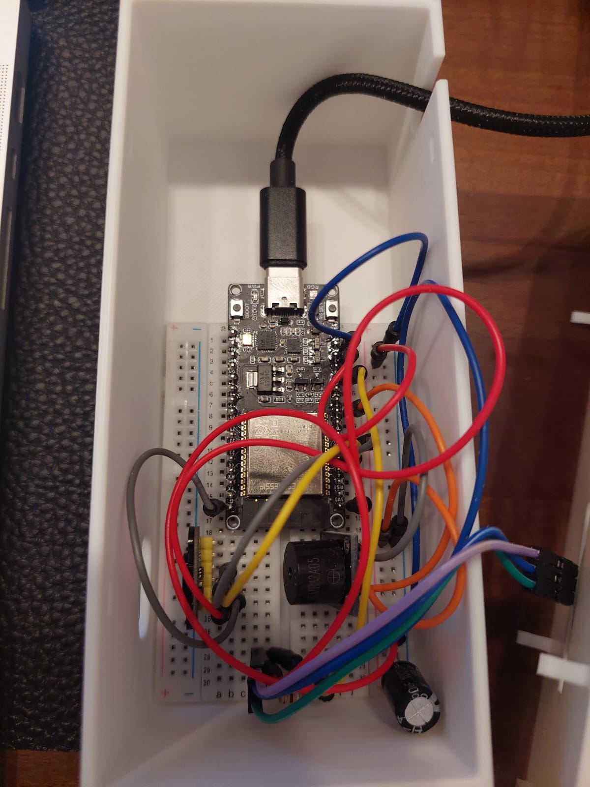
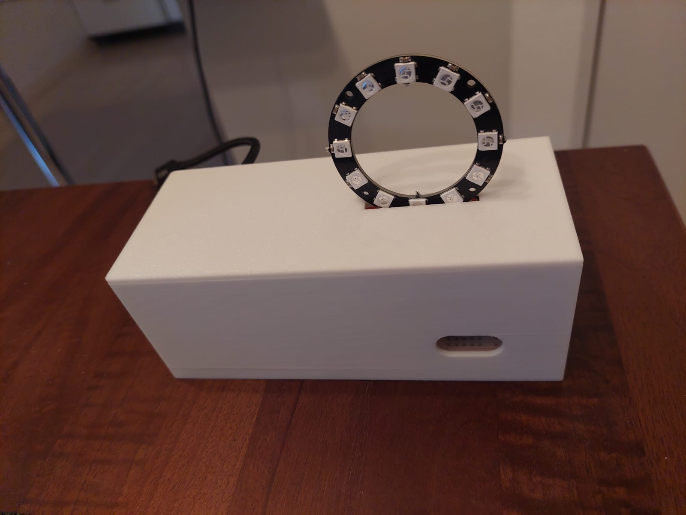
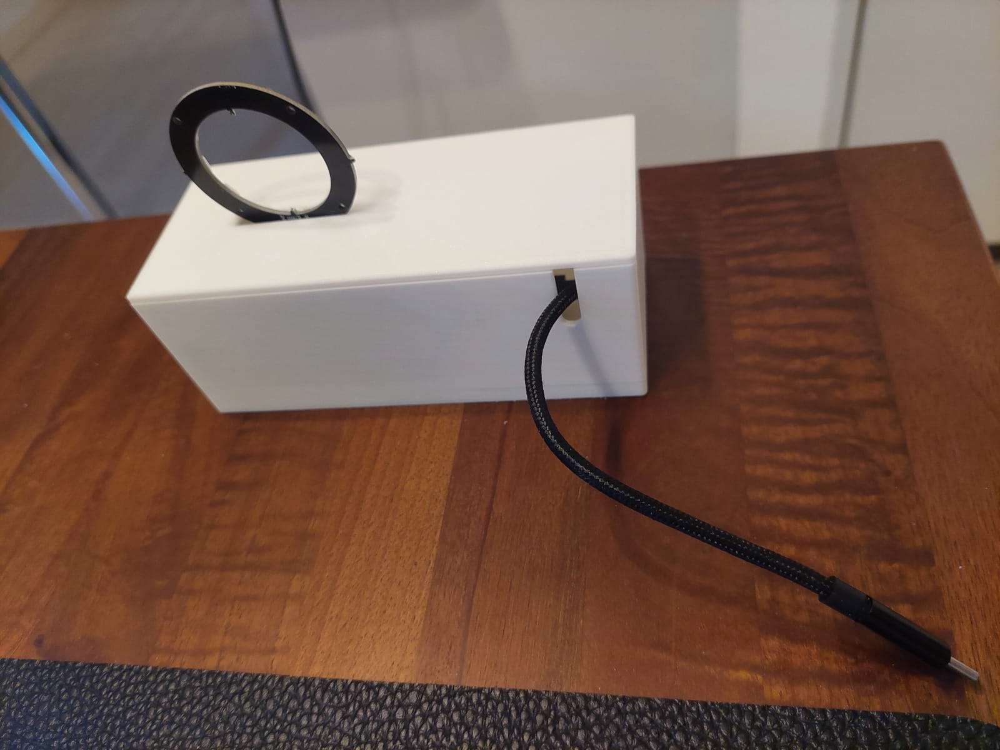
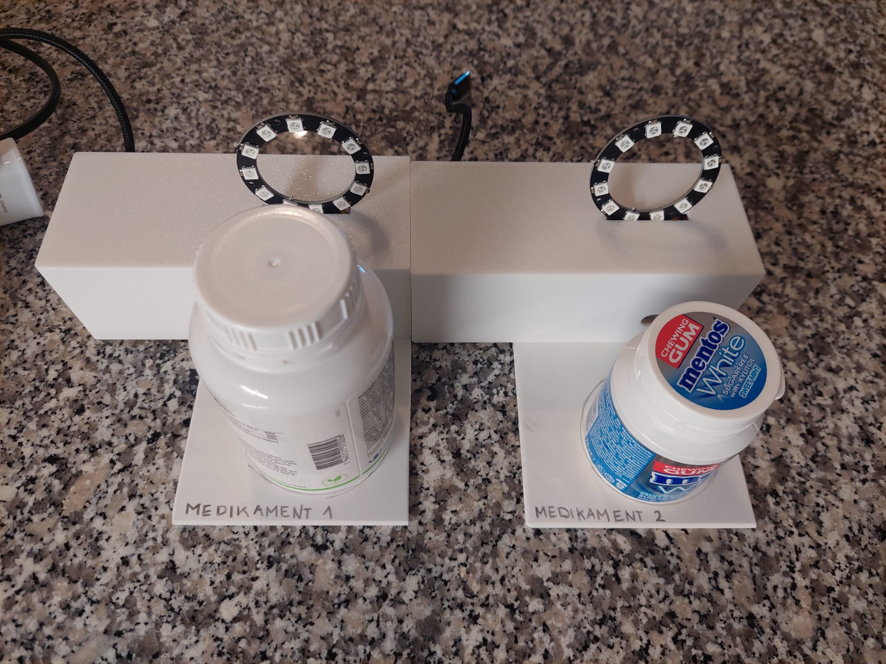

# BEAVERTIME - B-On-Time

## TEAM:
- Silvana Waser
- Nadia Giliberti


# Überblick

**Beavertime** ist ein smartes Erinnerungssystem zur Medikamenteneinnahme, speziell entwickelt für Personen mit Hör- oder Sehbeeinträchtigung. Es kombiniert LED-Signale mit akustischem Feedback und einer benutzerfreundlichen App zur Verwaltung der Medikamentenpläne.
Das System verfügt über zwei Medikamentenplätze, wodurch bis zu zwei Medikamente gleichzeitig verwaltet werden können. Für jedes Medikament lassen sich Anzahl der täglichen Einnahmen, Menge pro Einnahme sowie die jeweiligen Uhrzeiten individuell einstellen.
Sobald eine Einnahme fällig ist, signalisiert ein LED-Ring visuell und ein lauter Signalton akustisch, dass das Medikament eingenommen werden muss.

---

# Inhaltsverzeichnis

## UX Dokumentation

### Titel

Beavertime leitet sich einerseits aus unserem Gruppennamen “Biberbande 🦫” und “Be on time” ab. Wir haben uns bei einem Biberbandenspiel kennen und lieben gelernt. Deshalb hat dieser Name eine emotionale Bedeutung für uns.
**Be on time** hört sich bei ungenauem Hinhören fast an wie **Beavertime** und passt zu unserem Konzept, Medikamente immer *on time* einzunehmen.

### Logo

Das Logo ist ein Biber mit einer Pillenkelle.

---

## Designkonzept

Für das Design haben wir uns bewusst für eine schlichte und klar strukturierte Benutzeroberfläche entschieden. Besonders wichtig war uns dabei die Nutzerfreundlichkeit für Personen über 50 Jahre. Klare Navigation, gut lesbare Schriftgrössen und eine intuitive Bedienung standen im Fokus.

**Homebildschirm:**
Der aktuelle Tag wird gross und gut erkennbar im oberen, mittigen Bereich angezeigt. Im unteren Bereich finden sich die eingetragenen Medikamente samt Einnahmezeiten. Zudem ist klar ersichtlich, wie viele Tabletten pro Einnahme eingenommen werden müssen.
Ein Slider ermöglicht einen einfachen und schnellen Wechsel zwischen dem Homebildschirm und der „Bearbeitung Tabletten“-Seite.

**Bearbeitung Tabletten:**
Auf dieser Seite werden alle bereits eingetragenen Medikamente übersichtlich angezeigt. Hier kann man entscheiden, ob ein Medikament gelöscht oder die Einnahme bearbeitet werden soll.
Über das Plussymbol lässt sich ein neues Medikament hinzufügen.

**Neue Tablette:**
Möchte man ein neues Medikament erfassen, wird man automatisch von der „Bearbeitung Tabletten“-Seite zur „Neue Tablette“-Seite weitergeleitet. Dort kann der Name des Medikaments eingetragen werden. Mit einem Klick auf „Weiter“ erscheint ein Pop-up zur weiteren Konfiguration.

**Pop Up:**
Im Pop-up können die Uhrzeit der Einnahme, die Anzahl der Tabletten pro Einnahme sowie die Wiederholung (täglich oder wöchentlich) eingestellt werden.

**Pop Up Wochentage:**
Wenn das Medikament nicht täglich, sondern nur an bestimmten Wochentagen eingenommen wird, kann man in diesem Pop-up gezielt die gewünschten Tage auswählen.

**Bearbeitung Einnahme:**
Sobald das Medikament und die erste Einnahme erfasst sind, kann man über die Seite „Bearbeitung Einnahme“ weitere Einnahmezeiten hinzufügen. Auch hier wird man erneut zum Pop-up weitergeleitet, um die Angaben entsprechend zu ergänzen.

---

## Screenshots

Hier der Link zum GIF (muss heruntergeladen werden)
[Link zum GIF](https://fhgraubuenden-my.sharepoint.com/personal/gilibernadia_fhgr_ch/_layouts/15/onedrive.aspx?id=%2Fpersonal%2Fgilibernadia%5Ffhgr%5Fch%2FDocuments%2F4%2E%20Semester%2FInteraktive%20Medien%2FBiberbande%2FDokumentation%2FVideo%2FOrder%20Video%20für%20Dokumentation&ga=1)

**Link Figma:**
[https://www.figma.com/design/TGLskOnKCRHrxdOJ6txQv4/Biberbande?node-id=0-1\&t=177QyXOKYJXFGXNV-1](https://www.figma.com/design/TGLskOnKCRHrxdOJ6txQv4/Biberbande?node-id=0-1&t=177QyXOKYJXFGXNV-1)

---

## Reproduzierbarkeit

### Für User:

1. Laden Sie die App herunter *(nicht im Prototyp enthalten)*.
2. Loggen Sie sich ein *(nicht im Prototyp enthalten)*.
3. Registrieren Sie Ihr/Ihre Medikamente auf der **Bearbeitung Tabletten** Seite, indem Sie auf das rote **Pluszeichen** drücken.
4. Geben Sie den Namen des Medikaments ein und bestätigen Sie mit **«weiter»**.
5. Legen Sie die **Uhrzeit** Ihrer ersten Einnahme fest.
6. Geben Sie die **Anzahl Tabletten** ein, die Sie bei dieser Einnahme einnehmen müssen.
7. Wählen Sie, ob die Einnahme **täglich** oder **wöchentlich** erfolgen soll. Falls Sie **wöchentlich** wählen, bestimmen Sie die gewünschten **Wochentage**. Bestätigen Sie anschliessend mit **«Abschliessen»**.
8. Nun haben Sie die Möglichkeit, **weitere Einnahmen** für dasselbe Medikament zu erfassen.
9. Wenn Sie fertig sind, kehren Sie mit dem roten **«X»** in der oberen linken Ecke zurück zum **Homebildschirm**.
10. Auf dem **Homebildschirm** sehen Sie nun, welche Medikamente **am aktuellen Tag** eingenommen werden müssen – inklusive **Uhrzeit** und **Anzahl Tabletten**.

### Für Entwickler:

1. Stecke das **Steckschema** nach *(siehe Bild unten)*.
2. Lade den Arduino Code auf deinen **Microcontrollerboard** hoch.

   > Wichtig: WLAN Code anpassen nicht vergessen!
3. Hier der Code:
   [https://github.com/NadiaGiliberti/Biberbande.git](https://github.com/NadiaGiliberti/Biberbande.git)
4. Achte darauf, dass das Board unter `Tools → Board` ausgewählt ist und der richtige **Port** verwendet wird.
5. Setze alle **HTML**, **CSS**, **JS** und **PHP**-Dateien auf. Siehe GitHub.
6. Erstelle die Datenbank:

   * Öffne **phpMyAdmin**
   * Füge den folgenden SQL-Code in das SQL-Feld ein:

```sql
-- phpMyAdmin SQL Dump
-- version 4.9.6
-- https://www.phpmyadmin.net/
--
-- Host: 3g119a.myd.infomaniak.com
-- Erstellungszeit: 14. Jun 2025 um 17:19
-- Server-Version: 10.6.19-MariaDB-deb11-log
-- PHP-Version: 7.4.33

SET SQL_MODE = "NO_AUTO_VALUE_ON_ZERO";
SET AUTOCOMMIT = 0;
START TRANSACTION;
SET time_zone = "+00:00";


/*!40101 SET @OLD_CHARACTER_SET_CLIENT=@@CHARACTER_SET_CLIENT */;
/*!40101 SET @OLD_CHARACTER_SET_RESULTS=@@CHARACTER_SET_RESULTS */;
/*!40101 SET @OLD_COLLATION_CONNECTION=@@COLLATION_CONNECTION */;
/*!40101 SET NAMES utf8mb4 */;

--
-- Datenbank: `3g119a_beavertime`
--

-- --------------------------------------------------------

--
-- Tabellenstruktur für Tabelle `einnahmedaten`
--

CREATE TABLE `einnahmedaten` (
  `id` int(10) UNSIGNED NOT NULL COMMENT 'automatisch erstellt',
  `id_medikamente` int(10) UNSIGNED DEFAULT NULL COMMENT 'greift auf die id in Tabelle 1 zu',
  `wochentag` varchar(10) DEFAULT NULL,
  `uhrzeit` time DEFAULT NULL,
  `anzahl` int(10) UNSIGNED DEFAULT NULL COMMENT 'Anzahl Medikamente, welche auf dem oled display angezeigt werden.',
  `einnahme_erfolgt` tinyint(1) DEFAULT NULL COMMENT 'gibt nur true oder false.',
  `intervall_id` int(11) DEFAULT NULL
) ENGINE=InnoDB DEFAULT CHARSET=utf8mb3 COLLATE=utf8mb3_general_ci;

--
-- Daten für Tabelle `einnahmedaten`
--

INSERT INTO `einnahmedaten` (`id`, `id_medikamente`, `wochentag`, `uhrzeit`, `anzahl`, `einnahme_erfolgt`, `intervall_id`) VALUES
(454, 36, 'Montag', '17:00:00', 1, 0, 2),
(455, 36, 'Dienstag', '17:00:00', 1, 0, 2),
(456, 36, 'Mittwoch', '17:00:00', 1, 0, 2),
(457, 36, 'Donnerstag', '17:00:00', 1, 0, 2),
(458, 36, 'Freitag', '17:00:00', 1, 0, 2),
(459, 36, 'Samstag', '17:00:00', 1, 1, 2),
(460, 36, 'Sonntag', '17:00:00', 1, 0, 2),
(461, 34, 'Montag', '17:01:00', 3, 0, 1),
(462, 34, 'Dienstag', '17:01:00', 3, 0, 1),
(463, 34, 'Mittwoch', '17:01:00', 3, 0, 1),
(464, 34, 'Donnerstag', '17:01:00', 3, 0, 1),
(465, 34, 'Freitag', '17:01:00', 3, 0, 1),
(466, 34, 'Samstag', '17:01:00', 3, 1, 1),
(467, 34, 'Sonntag', '17:01:00', 3, 0, 1);

-- --------------------------------------------------------

--
-- Tabellenstruktur für Tabelle `medikamente`
--

CREATE TABLE `medikamente` (
  `id` int(10) UNSIGNED NOT NULL,
  `medikamente` varchar(20) NOT NULL,
  `start_date` date DEFAULT NULL,
  `end_daten` date DEFAULT NULL,
  `status` tinyint(1) NOT NULL
) ENGINE=InnoDB DEFAULT CHARSET=utf8mb3 COLLATE=utf8mb3_general_ci;

--
-- Daten für Tabelle `medikamente`
--

INSERT INTO `medikamente` (`id`, `medikamente`, `start_date`, `end_daten`, `status`) VALUES
(34, 'Eisentablette', '2025-06-13', NULL, 1),
(36, 'Dafalgan', '2025-06-14', NULL, 1);

--
-- Indizes der exportierten Tabellen
--

--
-- Indizes für die Tabelle `einnahmedaten`
--
ALTER TABLE `einnahmedaten`
  ADD PRIMARY KEY (`id`),
  ADD KEY `id_medikamente` (`id_medikamente`);

--
-- Indizes für die Tabelle `medikamente`
--
ALTER TABLE `medikamente`
  ADD PRIMARY KEY (`id`);

--
-- AUTO_INCREMENT für exportierte Tabellen
--

--
-- AUTO_INCREMENT für Tabelle `einnahmedaten`
--
ALTER TABLE `einnahmedaten`
  MODIFY `id` int(10) UNSIGNED NOT NULL AUTO_INCREMENT COMMENT 'automatisch erstellt', AUTO_INCREMENT=468;

--
-- AUTO_INCREMENT für Tabelle `medikamente`
--
ALTER TABLE `medikamente`
  MODIFY `id` int(10) UNSIGNED NOT NULL AUTO_INCREMENT, AUTO_INCREMENT=37;

--
-- Constraints der exportierten Tabellen
--

--
-- Constraints der Tabelle `einnahmedaten`
--
ALTER TABLE `einnahmedaten`
  ADD CONSTRAINT `einnahmedaten_ibfk_1` FOREIGN KEY (`id_medikamente`) REFERENCES `medikamente` (`id`) ON DELETE CASCADE ON UPDATE CASCADE;
COMMIT;

/*!40101 SET CHARACTER_SET_CLIENT=@OLD_CHARACTER_SET_CLIENT */;
/*!40101 SET CHARACTER_SET_RESULTS=@OLD_CHARACTER_SET_RESULTS */;
/*!40101 SET COLLATION_CONNECTION=@OLD_COLLATION_CONNECTION */;

```

7. Link zum GitHub-Repository:
   [https://github.com/NadiaGiliberti/Biberbande.git](https://github.com/NadiaGiliberti/Biberbande.git)

---

## Flussdiagramm


**Link zum Flussdiagram:**
[https://www.figma.com/design/TGLskOnKCRHrxdOJ6txQv4/Biberbande?node-id=47-344\&t=fM96IaxtLXgUX8Zf-1](https://www.figma.com/design/TGLskOnKCRHrxdOJ6txQv4/Biberbande?node-id=47-344&t=fM96IaxtLXgUX8Zf-1)

---

## Komponentenplan


## Steckschema
<p float="left">
  
  
</p>


---

## Umsetzungsprozess

### Entwicklungsprozess

Nachdem wir unsere Idee entwickelt haben und unser Design stand, machten wir uns mit der Steckplatine vertraut.
Wir fanden im GitHub Repository von **Jan Fiess** hilfreiche Anleitungen. Hier kombinierten wir unterschiedliche Steckschema-Vorgaben miteinander. Bei Fragen half uns **ChatGPT** oder die **Dozenten**.

### Verworfene Lösungsansätze, Fehlschläge und Umplanungen

Anfangs wollten wir gerne den **LED-Ring**, den **Piepser**, **Vibrator** und das **Display** in unserem Projekt integrieren.
Nach längerem Herumprobieren merkten wir jedoch, dass dies zu viel für den Mikrokontroller ist.
So riet uns auch unser Dozent, zwei Dinge wegzulassen. Also beschränkten wir uns auf den **LED-Ring** und den **Piepser**.

### Challenges

Eine grosse Challenge war das Verbinden der Datenbank mit der Webseite, sowie mit den Daten, die der **Distanzsensor** an die Datenbank schickt.
Anfangs war uns schleierhaft, welche Files dafür überhaupt nötig sind.
Mit Hilfe von **Folien**, **Google** und **KI** tasteten wir uns schrittweise zur Lösung vor.

### Lerneffekt

Wir hatten noch keine Erfahrung mit dem **Microkontrollerboard** und nur wenig Erfahrung mit **Datenbanken**.
In diesen Bereichen war der Lernfortschritt sehr gross.

Die Programmiersprache **C++** hatten wir vorher auch noch nicht gekannt.

### Known Bugs

Die Sensoren reagieren nicht immer reibungslos.
Manchmal hören sie nicht auf zu piepsen und manchmal reagieren sie vorzeitig.

**Ansonsten nichts. Unser Projekt ist perfekt!** 💅

---

## Planung

Wir teilten uns die Arbeit immer so auf, dass wir parallel an zwei verschiedenen Aufgaben arbeiteten.
Wir starteten mit dem Stecken unseres Projekts. Der Distanzsensor funktionierte schnell.
Allerdings war es anschliessend eine Herausforderung, zwei Distanzsensoren zu kombinieren, da sie dieselbe Adresse haben.

**Jan** hat uns hier netterweise geholfen und den passenden Arduino Code zur Verfügung gestellt.
Leider konnten wir diesen am Schluss nicht verwenden, da es zu viele Kabel für einen Mikrokontroller gewesen wäre.
So entschieden wir uns, mit zwei identischen Steckschemen zu arbeiten.

Beim Anschliessen des **LED-Rings** und des **Piepser** stiessen wir auf weitere Herausforderungen.
Einmal funktionierte es – und am nächsten Tag schon wieder nicht.
Es war mühsam, herauszufinden, ob der Fehler im **Code** lag oder ein **Bauteil defekt** war.

Gleichzeitig setzten wir das **Frontend (HTML und CSS)** sowie die **Datenbank** auf.
Dann begannen wir mit der Verknüpfung zwischen Webseite und Datenbank.

Im letzten Schritt sendeten wir die Daten des **Distanzsensors** an die **Datenbank** und schliesslich an die **Webseite**.

---

## Arbeitsaufteilung

* **Design:** Silvana
* **Frontend:** Teamarbeit
* **Backend:** Nadia
* **Dokumentation:** Teamarbeit
* **Steckschema:** Teamarbeit

---

## Hilfsmittel

Dieses Projekt wurde mit Unterstützung von **KI-Tools** wie **ChatGPT** und **GitHub Copilot** realisiert.
Sie kamen bei der Erstellung von Dokumentation, der Programmierung sowie beim Debugging zum Einsatz und haben den Entwicklungsprozess massgeblich erleichtert.

---

## Video Dokumentation

[Link zum Video](https://fhgraubuenden-my.sharepoint.com/personal/gilibernadia_fhgr_ch/_layouts/15/onedrive.aspx?id=%2Fpersonal%2Fgilibernadia%5Ffhgr%5Fch%2FDocuments%2F4%2E%20Semester%2FInteraktive%20Medien%2FBiberbande%2FDokumentation%2FVideo%2FOrder%20Video%20für%20Dokumentation&ga=1)

---

## Prototyp

Die Boxen wurden mit dem **3D-Drucker** hergestellt.
Die Boxen wurden separat gedruckt, da sie sonst zu gross für den Drucker gewesen wären.

<p align="left">
  
  
  
</p>


